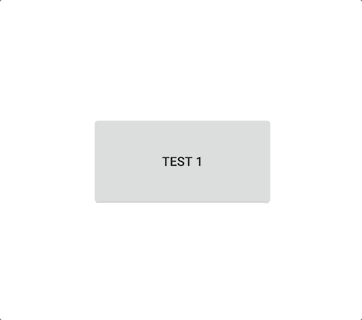

# Simple Android Preview 

Really Simple Android Preview Project what can help having inspiration💡

Based on simple stuff, Getting customizing and Aiming more complex project!

## Plan to support
Project will be updated several branches

- mvc pattern
- mvp pattern

## Languages, libraries and tools used
- [Kotlin](https://kotlinlang.org/)
- [RxJava2](https://github.com/ReactiveX/RxJava)
- [Retrofit2](https://square.github.io/retrofit/)
- [Gson](https://github.com/google/gson)
- [LiveData](https://developer.android.com/topic/libraries/architecture/livedata)
- [DataBinding](https://developer.android.com/topic/libraries/data-binding/)
- [ViewModel](https://developer.android.com/topic/libraries/architecture/viewmodel)

## Fake Server 
[https://my-json-server.typicode.com/myungjunChae/demo](https://my-json-server.typicode.com/myungjunChae/demo)
